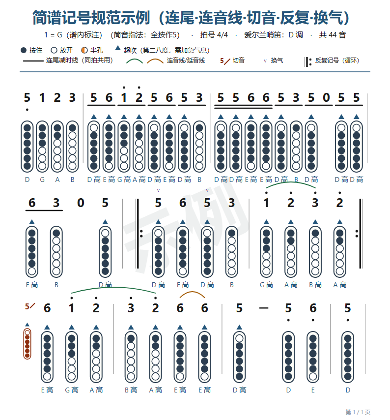
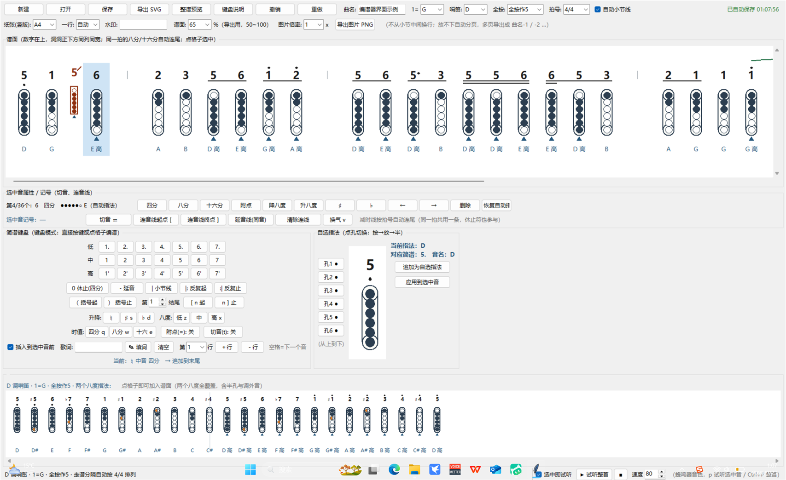
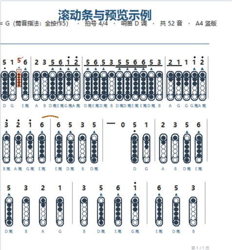
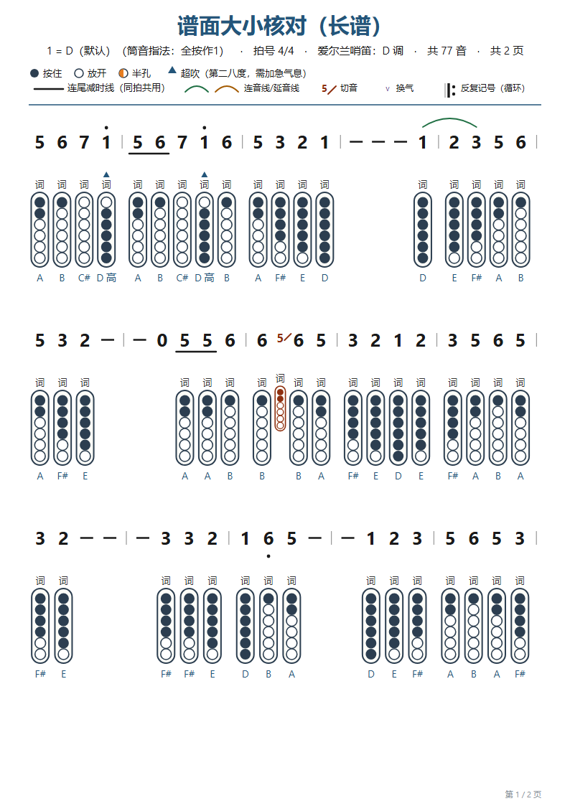
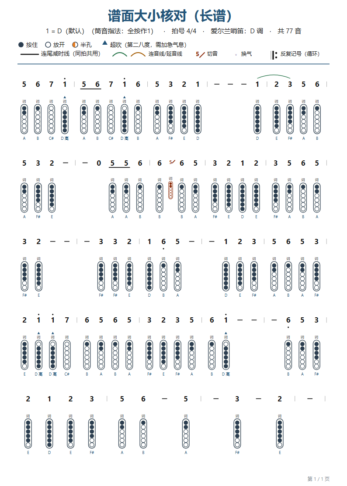
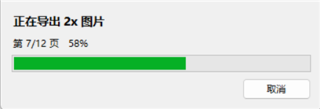
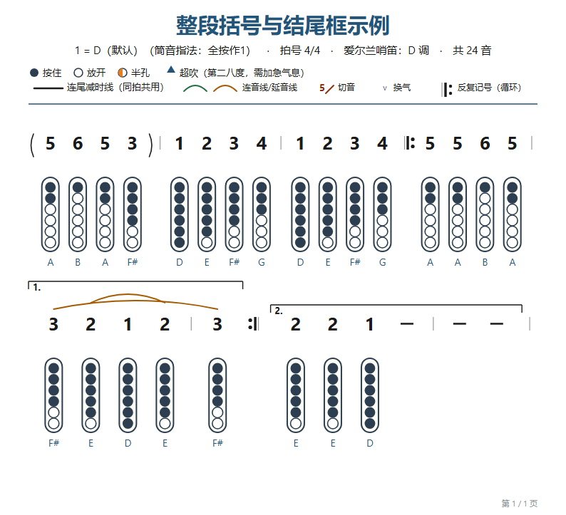

# 笛洞工坊 · 爱尔兰哨笛简谱编谱器（HoleScore）

> **笛**（爱尔兰哨笛）+ **洞**（洞洞谱：竖直笛身 + 六个孔）+ **工坊**（编谱、指法、试听、导出这一整套）。

把**简谱**（`5 3 2 1 6. 5 -`）编成**爱尔兰哨笛洞洞谱**——竖直笛身 + 六个孔 + 正上方同列的简谱记号，输出可直接打印的无损 SVG。

用笛洞工坊边听边敲：物理键盘打简谱、鼠标点洞洞调指法、实时预览，一键导出 SVG / PNG。


---

## 目录

- [它长什么样](#它长什么样)
- [功能特性](#功能特性)
- [快速开始](#快速开始)
- [打包成 exe](#打包成-exe)
- [当模块用](#当模块用)
- [简谱记号速查](#简谱记号速查)
- [笛洞工坊（编谱器界面）](#笛洞工坊编谱器界面)
- [项目结构](#项目结构)
- [工作原理](#工作原理)
- [工程文件格式](#工程文件格式)
- [测试](#测试)
- [常见问题](#常见问题)
- [已知限制](#已知限制)
- [许可证](#许可证)
- [致谢](#致谢)

---

## 它长什么样

导出的谱面（含图例、连尾减时线、连音线、切音窄格、反复记号、换气 v）：



图形化编谱器（键盘编谱 / 点洞洞编谱，实时预览）：



整谱预览窗口（换行版式与导出 SVG 一致，可缩放、跟随编辑自动刷新）：



**怎么读这张谱**：每列 = 一个音。数字是简谱记号，下面那张竖笛图是对应的指法。

| 记号 | 含义 |
| --- | --- |
| ● | 该孔按住 |
| ○ | 该孔放开 |
| ◐ | 半孔（半按） |
| ▲ | 超吹（第二八度，需要加急气息）；画在**洞洞图下沿与音名之间** |
| 数字 | 简谱音级（1-7，0 为休止） |
| 数字下横线 | 减时线：1 条 = 八分音符，2 条 = 十六分音符；**同一拍内相邻的短音符连成一条连续横线**（短休止符 `0/` `0//` 一样参与连尾） |
| 数字上的点 / 撇 | 高八度 |
| 数字下的点 | 低八度 |
| 数字上的 `v` | 换气记号（同时会把该列的连音弧线再往上抬一层） |
| 数字上的弧线 | 绿色 = 圆滑线（异音相连），棕色 = 延音线（同音相连） |
| 细线 + 粗线 + 两粒点 | 反复记号（循环符号）：`\|:` 反复开始、`:\|` 反复结束、`:\|:` 一段收尾并起下一段 |
| 音符两侧的 `(` `)` 弧 | 整段括号：把一段音整段括起来（前奏 / 间奏 / 和声伴唱） |
| 音符上方的横线 + 左端短钩 + `1.` | 「第 n 结尾」框（房子记号，配合反复用）：横线盖住那一段，标号写在框子里面左端 |
| 数字下方的歌词 | 可写多段（行），行数一多洞洞图自动往下让位 |
| 笛身下方 ▲ + 文字 | ▲ = 超吹，文字 = 绝对音名；带「高」表示第二八度 |

---

## 功能特性

### 输入

- **图形化编谱器**：物理键盘编谱、鼠标点洞洞编谱、逐孔调指法（唯一入口）
- 工程存成 JSON，随时接着编；改完立刻能看整谱版式预览

### 试听（边编边听）

状态栏右端一组小控件，**零第三方依赖**——直接按采样合成一段波形交给声卡播，边编边听：

- **选中即试听**（**默认关**，勾上才响）：选中框一动就响一下——点格子、按 `←` `→`、追加新音、
  撤销重做都算（这些路最后都会重画，统一在重画末尾看一眼，不会漏）。
  同一个音重复重画**不会**叠着响。勾上的那一刻会响一声，确认听得见
- **`p`**：把当前选中的音再响一次（开关关着也能用）
- **▶ 试听整首 / `Ctrl+P`**：按谱面时值从头放一遍（默认 80 bpm，可 `40~200` 调），
  休止符静音但照样占时间，延音线把前一个音拉长；**放的时候选中框跟着正在响的那个音走**
  （长谱会自动滚过去），随时按 ■ 停
- **■ 是真能立刻停的**：音是交给系统**异步**放的，`stop()` 当场就把声音掐掉，
  不用等当前这个音放完（早先用阻塞的 `winsound.Beep`，按下停止还得等满这个音——长音要 3 秒，
  看着就是「按钮没反应」）
- **音色是照着竖笛/哨笛调的**：正弦基频为主 + 少量二次谐波 + 一点点气声，首尾 12/45 ms 淡入淡出，
  不像 `Beep` 的方波那样刺耳带爆音 —— 方波在十六分音符这种长度（150 ms 上下）只剩「咔」的一声、
  听不出音高，现在十六分也是完整的一段音，照样听得清
- **声音最终走系统扬声器**（`winsound.PlaySound`），音量跟着系统音量走；
  万一这台机器没有音频设备，会自动退回 `Beep`（难听，但至少还有声音）
- **音高 = 谱面上写的那个音**（D 哨笛筒音 = D4 = 294 Hz）：哨笛调性 + 指法索引算出来。
  注意指法为了塞进两个八度的音域会把超范围的音**整体搬一个八度**（指法图照搬是对的，
  你只按得出音域内的孔），**试听会把这个搬移减回去** —— 否则谱面的高音会照着搬低后的
  指法响成低音。自选指法例外：那种按**孔位的实际发声**响

### 指法引擎

- 支持哨笛调性：**D / C / bB / G / F / bE**
- 音域：从筒音起**两个八度**，默认给出「全按作N」（N=1-7）的换算，例如 D 哨笛 `全按作5` ⇔ `1=G`
- **高八度筒音的指法**：筒音在更高八度的同一个音（高一个八度 `idx 12`、高两个八度 `idx 24`）主指法都是**「放开孔1、其余全按」**——全按虽然也能靠加重气息硬吹上去，但起音难、音准容易飘。**上下两个八度口径一致**（`HIGH_TONIC`），不会出现「同一个音名，一格放开孔1、另一格全按」；只有**第一八度的筒音照旧全按**。备选指法里仍保留「全按硬吹」
- 超音域自动移八度并给出提示；高难度的超吹音单独标记
- 每个音附带**备选指法**（交叉指法 / 半孔）
- 反查：任意指法可以反查它的音名与简谱记号

### 排版规范

- **减时线连尾**：同一拍内相邻的八分 / 十六分共用一条连续横线，十六分的第二条线只落在十六分音符下方（拍号决定分组单位）
- **休止符时值**：休止符也有八分 / 十六分（`0/`、`0//`），谱面在「0」下方画自己的减时线。短休止**与音符一视同仁参与连尾**——`5/ 0/ 5/` 是同一条横线贯穿三格；四分休止（`0`）不带减时线，自然打断连尾。画布与导出 SVG 同口径
- **延音横线「-」**：一道**定长**横线（`render.HOLD_W = 18`），水平居中在本格中心、竖向对准数字墨迹的**中心**（不是贴在基线上）。**长度绝不跟本行列距走**——导出里每行的列距是按内容自适应压出来的（`CELL_W` 58 一路压到 `PITCH_MIN` 26），旧口径画成「格宽 − 12」会让同一份谱里横线长短不一，而编谱器画布上的格子是定宽 60，同一份谱两处对不上；现在画布与导出各钉一个常量（`editor.HOLD_W = 17` ↔ `render.HOLD_W = 18`，差 1px 是因为画布上的数字本身小一号），测试锁住「两种密度下长度逐条相同」「定长且居中也对准墨迹中心」。它跟着「谱面大小」一起缩（与数字同比例），但因为 `HOLD_W < PITCH_MIN`，不影响一行排几个小节
- **超吹三角 ▲ 画在洞洞图下方、音名上方**：那一带本来是空的，所以三角能画到满号（`OCT_MARK_H = 11`），
  而且**位置和大小都与歌词无关**——老口径把它放在笛身上沿，那一带正是歌词的中心，于是带歌词时只能
  「搬到歌词上方再缩一号」，缩到 8px 再按默认的 `65%` 谱面大小导出，纸上基本看不出来（就是「输出谱面里
  没有超吹记号」的由来）。现在笛身横在三角与歌词中间，两者永远不会撞，也不必再为歌词让位。
  界面画布与导出 SVG 同口径（`editor.OCT_MARK_*` ↔ `render.OCT_MARK_*`），切音小图里的三角缩 `0.75`
- **连音线**：同音相连 = 延音线（棕），不同音相连 = 圆滑线（绿），画成数字上方的弧线
- **切音**：自己占一个小小的**窄格**，紧跟在该音前面，窄格内是「小数字 + 右上角小斜杠」+ 缩小版指法图
- **换气记号**：后缀 `v`（或勾上「换气 v」按钮），画在数字正上方；本格有 `v` 时连音弧线整体上抬，不会压在记号上
- **反复记号（循环符号）**：`|:` 反复开始、`:|` 反复结束、`:|:` 一段收尾并起下一段。它是一个独立事件（不占时值），**本身就是小节线的一种**——所以同一个位置上不会再出现普通小节线：紧挨在前的那条会被它顶掉，它落在小节中间时前面那半小节就由它收尾（**不补**收尾小节线，否则会画出 `1 2 3 | |:` 这种两条线堆一起的毛病）；导出画成「细线 + 粗线 + 两粒反复点」，粗线永远挨着反复点那一侧（`:|` 是 `|:` 的镜像）
- **歌词**：填在「简谱数字与洞洞之间」，可写**多段（多行）**；按整谱最多几行统一让位，洞洞图整体下移、行高一起长高，所以下一行不会被压住。**让位只作用于谱面（与整谱预览）**——指法表、自定义指法预览没有歌词，它们的洞洞图不跟着动（否则谱面一加歌词行，那两处会一起往下串，画布不够高就直接串出可视区）
- **整段括号**：成对圆括号 `（ ）`（半角 `(` `)` 也认）把一段音整段括起来——前奏 / 间奏 / 和声伴唱那一段。它是**记号而不是小节线**：不占时值、不算小节边界、**也不顶掉相邻的小节线**（这一点和反复记号正好相反）；但**贴着小节边界的那一侧要让位**：起点落在小节线之后、终点落在小节线之前（`（ 5 6 5 3 ） |`，而不是 `（ 5 6 5 3 | ）`），这样框才跟小节对齐。左右两侧**各自自足**（左括号画在起点那格左缘、右括号画在终点那格右缘），所以跨行也不会像连音线那样整条丢掉；高度与简谱数字**齐平**（上端略高于字形顶、下端盖住低八度点），不会一路拉到笛身。紧跟数字的括号仍是连音线后缀（`1(` 是圆滑线起点），独立出现的括号才走这条分支
- **「第 n 结尾」框（房子记号）**：`[1` 起、`1]` 止（序号写在任一侧都认，两端不必一致），用来配合反复记号标「第一遍 / 第二遍」。起止**手工指定**，框子从起点那一格一直画到终点那一格；贴着小节边界时与整段括号同口径（`[n` 落在线后、`n]` 落在线前）。横线压在这一段**所有记号之上**（高八度点、换气 `v`、落在这段里的连音弧线都要让开），标号 `1.` 写在框子里面左端。头顶要多留多少是**按实际内容算出来的**（`ending_top_need`）：行高、首页标题带、后续页紧凑页眉都据此多留一点，所以框子既不会压到上一行的音名、也不会压到页眉图例；朴素结尾框一点额外高度都不占。跨行时按行切开画，长结尾不会整条消失；缺一半（只写了 `[1` 或只写了 `1]`）画不出框来，导出前会在提示里点出来
- **自动小节线**：按拍号（2/4、3/4、4/4、3/8、6/8、2/2）自动分隔，也可关闭
- **竖线只有数字那么高**：小节线、反复起 `|:`、反复止 `:|` 的竖线高度都与简谱数字的字形**齐平**（上端到数字字形顶、下端到基线），不再一路拉到笛身。界面画布与导出 SVG 用同一口径，两侧各有一对常量（`DIGIT_TOP/BOT`、`DIGIT_TOP_DY/DIGIT_BOT_DY`）钉住，测试也从常量推导，改了不会漂
- 升降号、附点、高低八度点齐全

### 纸张与分页

- **纸张**：竖版 **A4 / B4 / A3**，页宽页高按毫米换算（`96dpi`），导出即可直接打印
- **一行几个小节可选**：`自动`（默认，按最少行数均分成 **4~6** 个）或固定 **2 / 3 / 4 / 5 / 6** 个——编谱器输出栏的「一行」下拉即可切换，工程里也会存下来
- **小节是最小换行单位**：任何时候都不会从小节中间断开
- **列距自适应**：同样几个小节，密一点就把列距压窄（下限 `PITCH_MIN=26px`，正好是笛身宽 24px 再留 2px 缝），所以一行里的音符排得满、又不至于把笛身图挤在一起
- **极密小节会破例**：一个 4/4 小节里塞进 9~12 格十六分音符时，列距压到下限也放不下 4 个 → 这一行降级成 3 个（宁可少排一个小节，也不把笛身图叠在一起）。整谱预览信息条会如实写「一行 N~M 小节」
- **不留孤行**：贪心「能塞多少塞多少」容易把料堆到前几行、尾巴甩一个 1 小节的孤行（4 个 7 格小节 → 3+1）。所以末尾还有一步**均分**把它掰成 2+2。只有两种情况会留下孤行：小节数在几何上就是奇数、一行又只放得下 2 个时（5 = 2+2+1）；或固定 2 个/行且小节数是奇数（13 = 2×6+1，上限卡死，躲不掉）
- 小节线和反复记号**不占满格**（细竖线不值得给整格宽度），不然一行会少排一个小节
- **谱面大小（导出缩放）**：数字、洞洞图、音名、歌词、各种记号**整体等比缩小**（`50%~100%`，默认 `65%`），行高也跟着缩，于是**一页能多装几行**。它**只缩纵向内容，不缩横向版式**——纸张、页边距、列距下限（`PITCH_MIN`）、一行几个小节都不跟着变，所以不会出现「字小了但笛身互相压」的错位。**只影响导出（SVG / PNG）与「整谱预览」，编辑区画布不受影响**（继续按 100% 画，编谱手感不变）
- **自动分页**：一页放几行由纸张高度、行高与「谱面大小」共同决定，**行不会跨页**；最后一页按内容裁短，不会甩出一整页空白。默认档（`A4 竖版 + 65%`）**首页 5 行**——连「数字下方带一行歌词」（行高要额外让位）也是 5 行。作为对照：`100%` 时 3 行、`80%` 时 4 行、`55%` 时 6 行；`70%` 是个微妙的坎——不带歌词 5 行，**加一行歌词就掉到 4 行**，所以默认没有选它
- **「第 n 结尾」框的头顶空间按内容算**：框子画在行顶上方，所以行高与首页/后续页页眉带会按**这一段里最高的记号 + 最深的连音弧线**多留一点（`ending_top_need`），保证框子既不压上一行的音名、也不压页眉图例。朴素结尾框（这一段里没有高八度点、没有换气 `v`、没有连音弧线）**一点额外高度都不占**；四层嵌套连音那种极端情况才会真的长高——不是拍脑袋定一个固定值
- 首页是完整标题区（曲名 / 调号 / 筒音指法 / 拍号 / 图例），第 2 页起是紧凑页眉，每页右下角有页码

同一份 107 音长谱、同样是 A4 竖版，只把「谱面大小」从 `100%` 调到默认的 `65%`：

| `100%` · 3 行/页 → **2 页** | `65%` · 5 行/页 → **1 页**（默认） |
| --- | --- |
|  |  |

（两图都是同一版式的真实导出，`谱面大小` 只缩内容、列距与纸张不变——所以字小了、一行的音符数量一模一样，只是行更矮、页里能多塞两行。）

### 输出

- **SVG**：矢量、无失真、可直接打印或转 PNG/PDF。**一页一个文件**——单页 `曲名.svg`，多页 `曲名-1.svg` / `曲名-2.svg` …
- **PNG 图片**：可选 **1x ~ 5x** 倍率（**默认 1x**），按纸张分页逐页出图（`曲名.png` / `曲名-1.png` …）。1x 时页面像素 = 纸张像素（A4 竖版约 794×1123），导出快、文件小；放到 5x 时同一张 A4 约 3970×5615（适合放大看细节 / 印大图）。**每一档都是矢量按目标像素重画**，不是把 1x 放大糊掉；倍率越高出图越慢、文件越大（5x 已经够用，再往上收益很小）
- **淡淡的水印**：自选文字，灰色 `10%` 不透明度、整页斜排，并且**画在谱面下层**（记号永远压在水印之上）——任何颜色打印都不影响阅读，留空则完全不画
- **HTML 总览页**：批量生成时自动产出 `index.html`，一页看完全部曲子
- 编谱器工程可存为 JSON（纸张 / 一行几个小节 / 水印 / 倍率 / **谱面大小**也一起存），随时继续编辑

### 大工程也不卡（进度条 + 并行）

谱子一大（几千个音、几 MB 的 JSON），「打开 / 保存 / 导出图片」就会花上好几秒，
界面在这期间是**冻住的**（tk 单线程），不给反馈看着就像卡死。三处分别做了处理：

- **打开 / 保存 / 导出都进了工作线程**，主线程弹一个进度条（读盘按字节、保存按「第 N/M 个音」、
  导出按页推进）；**不到 300 ms 就干完的话根本不弹窗**，小工程不会闪一下
- **打开工程不再重画十几次**：十几个控件连着 `set`，每个都挂着 trace（→ 重画整张谱面），
  1200 个音时一次重画 0.14 s，光这一下就卡一秒多。批量 `set` 期间屏蔽 trace，末尾只重画一次
- **多页 PNG 并行栅格化**（`PNG_WORKERS = 4`）：每页要起一次无头浏览器，启动是主要开销，
  实测 17 页 19.5 s → 9.4 s（2.1x）。**一次只挂 4 个、跑完一个补一个**，所以「取消」是真能停的
  （一次性把整批塞进线程池的话，`cancel()` 根本没机会被调用）——取消后已完成的那几页照常留下



自动保存仍在后台静默进行（几百毫秒以内，不值得为它弹窗）。

### 工程化

- **零第三方依赖**：只用 Python 标准库 + tkinter
- 全部核心逻辑都有自测用例（见[测试](#测试)）
- 可打包成免安装 exe，**目录版冷启动约 1 秒**（见[打包成 exe](#打包成-exe)）

---

## 快速开始

### 环境要求

- **Python 3.9+**（开发与测试环境为 3.13）
- **tkinter**：编谱器需要带 Tk 的 Python。大多数 Windows / macOS 官方安装包自带；Debian/Ubuntu 上需要 `sudo apt install python3-tk`
- 无需 `pip install` 任何东西

可选（只影响「导出 PNG」）：

| 功能 | 额外依赖 | 说明 |
| --- | --- | --- |
| 导出 PNG | 系统里的 Edge 或 Chrome | 把矢量谱面栅格化成图片；找不到时会提示，导出 SVG 不受影响 |

### 跑起来

```bash
# 笛洞工坊（唯一入口）
python editor.py
```

Windows 上也可以双击 `启动笛洞工坊.bat`。

> ⚠️ 那个 `.bat` 里写死了本机的 Python 路径（`G:\Conda\python.exe`）。换机器记得把里面的路径改成你自己的，或者直接用 `python editor.py`。

---

## 打包成 exe

```bash
# 目录版（推荐：启动快）
G:\Conda\python.exe build_exe.py

# 单文件版（方便传给别人，但每次启动都要自解压，明显更慢）
G:\Conda\python.exe build_exe.py --onefile
```

产出的 exe 里**只有编谱器**，双击即用，目标机器不需要装 Python。

| | 目录版 `dist/笛洞工坊/` | 单文件版 `dist/笛洞工坊-单文件.exe` |
| --- | --- | --- |
| 交付方式 | **整个文件夹**一起拷 | 单个 `.exe` |
| 冷启动 | 约 1.0 秒 | 慢很多（每次解压几十 MB 到 `%TEMP%`） |

打包脚本会自动做三件事：剪掉 tcl/tk 用不上的数据、用 `--exclude-module` 排掉用不到的模块、
然后**真的把产物跑一遍自检**（tcl/tk 能不能画、模块齐不齐、能不能渲染 SVG、自动保存落没落到 exe 旁边、能不能调 Edge 导 PNG）——
因为「排错模块」在打包阶段**不报错**，只在运行时才炸。

> ⚠️ 必须用**带 tkinter** 的 Python 打包。托管运行时（`~/.workbuddy/binaries/python/...`）没编 tkinter，
> 打出来的 exe 会在启动时报 `No module named '_tkinter'`，而打包阶段不会报错 —— 脚本会先拦一道。

---

## 当模块用

不需要命令行：编谱器的导出就是 `tinwhistle.project` 上的两个函数。

```python
from tinwhistle import project as pj

proj = pj.new_project("小星星", key="G", whistle="D", beats="4/4", auto_bars=True)
proj["notes"] = [pj.token_to_doc(t) for t in "5/ 3/ 2 1 6. 5 - 0".split()]

paths = pj.export_svg_pages(proj, "output")          # 一页一个文件，返回全部路径
pj.export_png(proj, "output", scale=1)               # 需要系统里有 Edge/Chrome；默认就是 1x

# 「谱面大小」不传则用工程里存的值（新工程默认 0.65）；
# 也接受 70 这种百分数，内部会收进 [0.5, 1.0]
pj.export_svg_pages(proj, "output", content_scale=0.65)
```

---

## 简谱记号速查

书写格式就是「编谱器里的人工可读格式」，工程文件里的 `token` 字段用的也是这套写法。

| 类别 | 写法 | 例子 | 说明 |
| --- | --- | --- | --- |
| 音级 | `1`–`7` | `5` | do…si |
| 休止 | `0` ＋ 时值后缀 | `0` `0/` `0//` | 和音符一样吃时值后缀：八分休止 `0/`、十六分休止 `0//`、附点四分休止 `0*` |
| 升降号 | `#` / `b` 前缀 | `#4` `b7` | |
| 低八度 | 后缀 `.` | `6.` | 两个点 `6..` = 低两个八度 |
| 高八度 | 后缀 `'` | `1'` | 两个撇 `1''` = 高两个八度 |
| 八分音符 | 后缀 `/` | `5/` | 无后缀 = 四分音符 |
| 十六分音符 | 后缀 `//` | `5//` | |
| 附点 | 后缀 `*` | `5*` `5/*` | 附点四分、附点八分 |
| 切音 | 后缀 `!` | `5!` | 吐音 / 切分；谱面里自占一个小窄格，画在该音前面 |
| 换气 | 后缀 `v` | `5v` `5/v` | 数字正上方一个小 `v`；连音弧线会自动上抬避让 |
| 连音线起点 / 终点 | 后缀 `(` / `)` | `5(` … `3)` | 同音高 = 延音线，不同音高 = 圆滑线 |
| 与下一音相连 | 后缀 `~` | `5~` | |
| 延音 | `-` | `5 -` | 延长前一个音，不产生新指法。谱面里是一道**定长**横线：居中于本格、竖向对准数字墨迹中心，长度不随本行列距变（画布与导出同一口径） |
| 小节线 | `\|` | `5 \| 3` | 仅用于排版分组 |
| 反复记号 | `\|:` `:\|` `:\|:` | `1 2 3 4 \|: 5 6 7 1 :\|` | 循环符号，不占时值；自动小节线下不会被重排掉 |
| 整段括号 | `（` `）`（半角 `(` `)` 同） | `1 2 （ 3 4 ） 5` | 把一段音整段括起来（前奏 / 间奏 / 和声伴唱）。不占时值、**不是小节边界**、也不顶掉相邻小节线，但贴着边界的那一侧会让位：起点落在线后、终点落在线前（`\| （ 5 6 5 3 ） \|`）；左右两侧各自画在自己那一格边缘，跨行不丢 |
| 第 n 结尾框 | `[n` … `n]` | `\|: 1 4 [1 5 5 1] :\| [2 6 6 2]` | 房子记号，配合反复用。起止手工指定，横线压在这一段所有记号之上，标号 `1.` 写在框内左端；序号写在任一侧都认（`[1` 那边写了就用它的）。**收尾那个 `n]` 里的 `n` 是标号、与 `[n` 呼应，不是音符** —— 要在收尾这一格放音就多写一格（`1 1]`）；这么定是因为收尾常落在延音/休止上，`-]` 解析不出记号，标号必须自带 |
| 调号头 | `1=X` | `1=G` | 出现在文本任意位置都会被识别并从正文中剔除 |

**后缀顺序无所谓**：`5/!`、`5!/`、`5!` 写法等价，方便手工输入。

整段括号与「第 n 结尾」框的实际效果（前奏用 `（ 5 6 5 3 ）` 整段括起来；
两个结尾框配 `|: :|` 用——`1.` 那个框里带了连音线，横线自动压到弧线之上；`2.` 那个是朴素的，不占额外行高）：



**休止符也吃后缀**：`0` 四分休止、`0/` 八分休止、`0//` 十六分休止、`0*` 附点四分休止。

**其它字符一律忽略**（歌词、标题、括号等），所以可以直接把整行带歌词的简谱粘进来。

一个综合例子：

```
1=G 5/ 3/ 2 1 | 6. 5 - 0/ 0/ | 1'! 7 6 5 | 5( 3) 2~ 1 |: 5v 3/ 2/ 1 :|
```

---

## 笛洞工坊（编谱器界面）

```bash
python editor.py
```

### 界面布局

```
┌ 工具栏：新建 打开 保存 导出SVG 整谱预览 撤销 重做 | 曲名 | 1=X | 哨笛 | 全按作N
├ 输出设置：纸张(竖版) A4/B4/A3 | 一行 自动/2~6 | 谱面 100~50%（导出用） | 水印 文字 | 图片倍率 1x~5x | 导出图片PNG
├ 谱面编辑区（横向滚动条整条可拖；滚轮横向滚、Shift+滚轮纵向滚；新加的音跑出屏外时自动跟过去）
├ 属性条：选中音的时值 / 八度 / 升降 / 删除 / 左右移动 / 恢复自动指法
├ 左：简谱键盘（低 / 中 / 高三行 × 1-7）+ 休止/延音/小节线/反复起止 + （ ）整段括号 + 第 n 结尾框 + 时值/附点/升降 + 节拍
├ 右：自选指法（逐孔切换 按→放→半）+ 大图预览 + 反查音名/简谱
├ 指法表：当前哨笛 + 当前「全按作N」下的两个八度指法（点格子即可编谱）
└ 状态栏：工程路径、音数、自动保存时间、提示
```

**光标**：编辑区里当前是**竖线光标**（亮蓝色的 `I` 形线条，上下各有一道小横帽），
不是整格方框——不开「插入到选中音前」时光标停在**曲末**（新音追加到最后），
勾上并选中某个音后光标移到那一格的**左边缘**（新音插在它前面）。
它与小节线刻意做了区分：小节线是**灰色细竖线、没有横帽**。

### 物理键盘

键盘就是界面上那排简谱按钮的等价物（键位都标在按钮文字上）。

| 键 | 作用 |
| --- | --- |
| `1`–`7` | 加音 |
| `0` | 加休止（**用当前时值**：先按 `w` 再按 `0` = 八分休止 `0/`，`e` + `0` = 十六分休止 `0//`） |
| `-` | 加延音 |
| `\|` | 加小节线 |
| `r` / `R` | 加反复记号 `\|:` / `:\|` |
| `v` / `V` | 给选中音切换换气记号 `v` |
| `z` / `x` | 降 / 升八度（`↓` / `↑` 同效） |
| `s` / `d` | 升号 / 降号 |
| `q` / `w` / `e` | 四分 / 八分 / 十六分音符 |
| `=` | 切附点 |
| `t` | 切音（有选中音则改选中音，否则切换「新音默认带切音」） |
| `[` / `]` | 连音线起点 / 终点 |
| `\` | 延音线（与下一音相连） |
| `(` / `)` | 整段括号起点 / 终点（把一段音括起来） |
| `Alt` + `[` / `]` | 「第 n 结尾」框起点 / 终点（`n` 取界面上「第 n 结尾」那个框，默认 1） |
| `←` / `→` | 选上一个 / 下一个音 |
| `Del` / `BackSpace` | 删除选中音 |
| `Ctrl+Z` / `Ctrl+Y` | 撤销 / 重做 |
| `Ctrl+S` | 保存工程 |
| `Ctrl+E` | 导出 SVG |
| `Ctrl+L` | 聚焦歌词输入框 |
| `F5` | 整谱预览 |
| `p` | 试听当前选中的音 |
| `Ctrl+P` | 试听整首（再按一次停止） |

焦点在歌词 / 曲名输入框里时，全局快捷键会自动让路（往输入框打 `5` 不会顺手在谱面插一个音）。

### 编谱流程

1. **新建** → 选曲名、`1=X`、哨笛调性、拍号
2. 用键盘或鼠标加音；选中某列后可以在属性条改时值 / 八度 / 升降，或让它在谱面上左右移动
3. 需要特定指法时，在右侧「自选指法」逐孔切换，点「应用到选中音」
4. **歌词**：点「填词」或 `Ctrl+L`，打字即写入当前音，空格保存并跳到下一个音
   （**`Tab` 也能跳，而且没有任何歧义**：输入法不吃这个键，按下立刻就跳，不用等）。
   多段词用「第 N 行」下拉选第几行来写（如第 1 段中文、第 2 段拼音），
   「＋行」/「－行」增删段数——**段数一多，谱面会自动往下让位并把行长高**，导出同样如此

   > **中文输入法**：空格 / 回车在输入法里也是「选候选上屏」用的。好在这个键到底给了谁不必猜
   > —— Tk 把整个上屏当成一次按键交给程序，**keysym 还是 `space`，但事件里的字符（`%A`）
   > 是上屏的那个字**。字符是别的字 ⇒ 输入法的活，程序放行让字进框；字符还是空格 / 回车 ⇒
   > 用户真的在按这个键，立刻跳到下一个音 —— 零延迟，不用等任何时间窗口。
   > 万一还有漏网的：`Tab` 也能跳（输入法不吃这个键），或者跳错了 `Ctrl+Z` 撤回来。
   >
   > 真出了「某个字一打就跳格」这种事，双击 **`诊断歌词跳格.bat`** 再复现一遍，关掉程序后
   > 会自动弹出 `tests/_ime_debug.log` —— 里面记着每个按键到达时的字符、输入法状态和输入框
   > 内容。这个 bug 的前两版修复都是靠猜等待时间，两版都没中；日志一开，真相就在第一行。
5. **框类记号**：要标前奏 / 间奏 / 和声伴唱那一段，点「（ 括号起」「） 括号止」（或按 `(` `)`）；
   要标第一遍 / 第二遍结尾，先在「第 n 结尾」选好序号再点「[ n 起」与「n ] 止」（或按 `Alt+[` / `Alt+]`）
   —— 两者都不占时值、都不是小节边界，落在哪一拍就是哪一拍。
   框里要盖住哪个音，就把起止点落在它的**外面一格**（收尾那格的 `n]` 只是标号，本身不带音）；
   贴着小节边界时两者都按记谱口径让位：起点落在线后、终点落在线前（`| （ 5 6 5 3 ） |`）
6. **F5 整谱预览**：看导出后的版式——按当前纸张**一页一页摊开**（首页大标题区、后续页紧凑页眉、页脚页码），一键用浏览器打开真实导出 SVG（100% 保真）
7. 在「输出设置」栏选纸张 / 一行几个小节 / **谱面大小** / 填水印 / 选倍率（1x~5x），然后 **导出 SVG** 或 **导出图片 PNG**
   （放不下会自动分页，多页就出多个文件：`曲名-1.svg` / `曲名-2.svg` …）

**谱面大小**（输出栏 `谱面 N%`，`100~50`，默认 `65`）只作用于导出与整谱预览：调小以后数字、洞洞图、歌词、记号一起等比缩小，行高同步变矮，**一页能多装几行**（导出后想再微调字号，不必回头改曲子）。它**不动编辑区画布**——画布始终按 100% 画，编谱时看得清；横向版式（纸张 / 页边距 / 一行几个小节）也不跟着变，所以不会出现「字小了但笛身挤在一起」。导出的 PNG 倍率与它互不影响：`谱面 65% + 1x` 和 `谱面 100% + 1x` 是同一张纸、同一套列距，只是内容大小不同。

工程会自动保存到 `projects/autosave.json`，崩溃/误关也不会丢。
纸张 / 一行几个小节 / 水印 / 倍率 / **谱面大小**也一起存进工程，下次打开还在。

### 自动跟随

谱面主区是一条无限长的横带，长谱往右写出去时**新加的音会跑到屏幕外**——所以每次加音后都会检查一下：新音若不在可见范围内，谱面区**自动横向滚**过去（左边留半格上下文，方便接着往下写）。它只在**真的加了新音**时动：手动拖到别处后普通重画不会把视线抢回去，短谱（本来就全看得见）则完全不折腾滚动条。

### 整谱预览

谱面主区是一条无限长的横带（方便连续编谱），看不到「导出后长什么样」。预览窗口补上这一环：用导出那一套版式规则（纸张、一行几个小节、**谱面大小**、不从小节中间换行、行不跨页）把整首曲子**一页一页摊开**，单格仍用主谱面区的画法，所以 **预览 = 主谱面区的画法 + 导出版式**。窗口内可缩放 / 滚动、可跟随编辑自动刷新；顶部还会显示「纸张 / 页数 / 行数 / 谱面 N% / 一行几个小节」，排版一有问题就能立刻看出来。改「谱面大小」下拉会**立刻**反映到预览上（行数、页数跟着变），而主编辑区画布不跟着缩。

---

## 项目结构

```
miusicv/
├── README.md               本文件
├── .gitignore
├── editor.py               编谱器（唯一入口：所见即所得，键盘 / 鼠标编谱）
├── 启动笛洞工坊.bat           Windows 快捷启动（需改里面的 Python 路径）
├── build_exe.py             打包成 exe（目录版 / 单文件版 + 打包后自检）
├── packaging/
│   ├── entry_editor.py      exe 入口：正常启动 / 兜底报错 / --selfcheck
│   ├── make_icon.py         SVG → 无头 Edge 截图 → PNG → ICO
│   └── icon.ico             图标
├── tinwhistle/
│   ├── __init__.py
│   ├── apppaths.py         程序根目录定位（源码运行 / 打包后都能找对 output、projects）
│   ├── jianpu.py           简谱文本解析：记号 → NoteEvent 序列（含调号头与时值）
│   ├── fingering.py        指法引擎：音高 → 六孔状态、自动移八度、转调、备选指法
│   ├── beaming.py          减时线连尾 + 连音线分组（简谱规范）
│   ├── render.py           SVG 渲染（纸张 / 一行几个小节 / 自动分页 / 水印 / 谱面大小缩放）+ HTML 总览索引
│   ├── imageout.py         SVG → PNG：调用无头 Edge/Chrome 按倍率出图、按页分文件
│   ├── procutil.py         跑外部命令的薄封装（**宽松解码**，中文 Windows 上不被 GBK 卡死）
│   ├── sound.py            试听：音高换算（哨笛调性 + 指法 → Hz）、谱面 → 节目单、
│   │                       合成音色（正弦谐波 + 包络 → 临时 wav）与播放线程（可立刻停）
│   └── project.py          编谱器工程模型：JSON 存取、导出（SVG 多页 / PNG）、token ↔ 文档互转
├── tests/                  自测与 QA 用例（见下）
├── docs/images/            README 配图
├── projects/               编谱器工程（*.json，含 autosave.json）
└── output/                 默认输出目录（SVG / PNG / HTML）
```

---

## 工作原理

```
编谱器工程 ──┐
             ↓
      jianpu.parse()          记号 → NoteEvent 序列（音级 / 八度 / 时值 / 记号）
             ↓
   insert_auto_bars()         按拍号插入小节线
             ↓
  fingering.map_score()       逐音映射到哨笛指法（自动移八度 + 超音域提示）
             ↓
    beaming.beam_segments()   计算连尾减时线与连音线分组
             ↓
     render.render_svg()      生成 SVG 字符串
             ↓
        output/*.svg + index.html
```

几个设计上的取舍：

- **解析与渲染解耦**：`jianpu` 只产出音高/时值事件，`fingering` 只关心音高到孔位的映射，`render` 只负责画。三者都可以单独测。
- **编谱器与导出共用一个排版层**：切音窄格的宽度、歌词让位的偏移、超吹三角的避让规则、**整段括号与结尾框的格宽 / 高度口径**在画布与 SVG 两条渲染线上是同口径的，避免「界面上好、导出后错位」。
- **同一套规则有两份实现，必须一起改**：自动小节线有两处（`jianpu.insert_auto_bars` 走导出与测试、`project.display_notes` 走编谱器），框类记号的语义（不占时值、不是小节边界）在两边都写了一遍——只改一处就会出现「导出对了、编辑器还错」的假修复。测试里专门有一条断言「两条实现给出同一串记号」。
- **「同一个音」的规则要写成通则，别写成某一格的实例**：高八度筒音的指法（放开孔1、其余全按）原来只写成 `if idx == 12` 一条特例，于是**第三八度**（`idx 24`，指法表末格、标签 `5'`）掉回 `_FIRST_OCTAVE[0]` 被画成全按——同一个音名在两个八度里给出互相矛盾的孔位，看起来就像指法表错了。现在收成 `HIGH_TONIC` + `is_high_tonic()`（12 的正整数倍），音域以后再往上加八度也自动跟着对；测试同时锁三处口径：**函数**（`selftest`）、**画布指法表**（`editor_selftest` 直接读画布上的孔位圆）、**导出 SVG**（`qa_edge_jianpu_render` 读导出的 `<circle>`），并断言「整个音域里只有第一八度的筒音是全按」。
- **行高必须把「行间空白」算进去**：连音弧线画在数字上方、会高出行顶（约 29px，嵌套每层 +9，带换气再 +18）。这段高度只能由**上一行下方**留出的空白提供，所以 `row_height() = 基准行高 + 歌词让位量 + 固定行距 ROW_GAP`。少了最后一项，下一行的弧线就会压到上一行的音名上。
- **歌词让位量与行高都随行数增长，且能收回**：整谱按**最多那几行**统一让位（不是一个音一个样），行数减回去时让位量也一起收回——不是单向膨胀。
- **「谱面大小」只缩内容、不缩版式**：横向常量（`CELL_W` / `PITCH_MIN` / 页边距 / 纸张 / 一行几个小节）**一个都不缩放**，只把纵向内容（数字 `NOTE_SIZE`、笛身 `FLUTE_H`、孔半径、音名、歌词、各种偏移）乘一个系数 `k`，行高也随之按 `k` 收。这样「字变小了、笛身不会互相挤」，横向排版与 `100%` 完全一致——测试里专门断言了「改谱面大小后一行几个小节、列距、纸张尺寸都不变」。
- **缩放靠「基准值 + 重算」，不靠累乘**：模块导入时先把 `100%` 的值抄进 `_SCALED_BASE`，每次 `set_content_scale(k)` 都从基准重新算一遍（而不是在当前值上再乘），所以来回调不会漂。派生的量（`FLUTE_W` / `HOLE_R` / `MINI_*` 等）也在同一处重算，几何恒等式（如笛身宽 = 2×半宽、孔距比例）始终成立。导出走 `content_scale_ctx(...)` 上下文管理器，**用完把模块级状态还原**，不会污染后续任何一次直接 `render` 调用。
- **缩放要和整数友好**：`_s()` 在结果恰好是整数时返回 `int`（`26.0 → 26`），于是 `font-size="26"` 这类「`100%` 下逐字节可复现」的断言不用改；只有非整数才保留小数。这条是为了让新功能**不breaking老测试**——`100%` 时的 SVG 输出与加缩放之前完全一致。

---

## 工程文件格式

编谱器工程是普通 JSON，可以直接手改或进版本库：

```json
{
  "version": 1,
  "title": "编谱器示例-爱尔兰风格",
  "key": "D",
  "whistle": "D",
  "beats": "4/4",
  "auto_bars": true,
  "paper": "A4",
  "row_measures": 0,
  "watermark": "",
  "scale": 1,
  "content_scale": 0.65,
  "saved_at": 1789911092.435085,
  "notes": [
    { "kind": "note", "degree": 1, "accidental": 0, "octave": 0,
      "duration": 1.0, "holes": null, "short": false },
    { "kind": "bar", "duration": 1.0 },
    { "kind": "repeat", "direction": "start" },
    { "kind": "note", "degree": 3, "accidental": 0, "octave": 0, "duration": 0.5,
      "holes": null, "short": false, "breath": true,
      "lyric_lines": ["长", "chang"], "lyric": "长" },
    { "kind": "note", "degree": 5, "accidental": 0, "octave": 0,
      "duration": 1.0, "holes": [1, 1, 1, 0, 0, 0], "short": false,
      "slur_start": true }
  ]
}
```

顶层字段：`version` 文档版本、`title` 曲名、`key` 曲调 `1=X`、`whistle` 哨笛调性、
`beats` 拍号、`auto_bars` 是否自动小节线、`paper` 纸张（`A4`/`B4`/`A3`）、
`row_measures` 一行几个小节（`0` = 自动）、`watermark` 水印文字、`scale` PNG 倍率（`1~5`）、
`content_scale` 谱面大小（`0.5~1.0`，缺省按 `0.65` 收口）、`notes` 音符序列、
`saved_at` 保存时间戳（`projects/autosave.json` 里还会多一个运行时字段 `_path`）。

写盘是**分块**做的（为了进度条能按「第 N/M 个音」推进），但拼出来的文本与
`json.dump(project, indent=1)` **逐字节一致**——所以这个文件仍然可以放心手改、放心进版本库
（测试里对四种工程形状逐字节钉住，改缩进规则的红线就在这里）。写的时候先落 `.tmp` 再原子替换，
自动保存不会把工程写坏；读取则按 1 MB 一块读盘顺手报进度。

音符 / 记号字段：

| 字段 | 说明 |
| --- | --- |
| `kind` | `note` 音 / `rest` 休止 / `hold` 延音 / `bar` 小节线（这三种只有 `kind` 与 `duration`）/ `repeat` 反复记号 / `bracket` 整段括号 / `ending` 「第 n 结尾」框（最后三种都不占时值） |
| `degree` | 音级 1-7 |
| `accidental` | `1` 升号、`-1` 降号、`0` 无 |
| `octave` | `0` 中、`1` 高八度、`-1` 低八度 |
| `duration` | 以四分音符为 1（`0.5` 八分、`0.25` 十六分、`1.5` 附点四分） |
| `holes` | `null` = 按音高自动查指法（推荐，改哨笛调性时会自动跟随）；给了 6 元则用自选指法（`1` 按 / `0` 放 / `2` 半孔） |
| `short` | `true` = 切音（占一个小窄格） |
| `breath` | `true` = 换气记号 `v`（画在数字正上方） |
| `direction` | 方向：反复记号 `start` = `\|:` / `end` = `:\|` / `both` = `:\|:`；整段括号 `start` = `（` / `end` = `）`；结尾框 `start` = `[n` / `end` = `n]` |
| `n` | 「第 n 结尾」框的序号（`1` 起；两端各写各的，通常一样） |
| `lyric_lines` | 多段歌词（`["第一段", "第二段", ...]`，空行占位保留）；`lyric` 是第一段的兼容副本 |
| `lyric` | 歌词第一段；填了又清空会被删键，所以「没填过」和「清空后」序列化结果一样 |
| `slur_start` / `slur_end` | 连音线起点 / 终点（同音高为延音线，异音高为圆滑线） |
| `tie` | `true` = 与下一音用延音线相连 |

工程也可以直接手写成简谱记号再导入，`project.token_to_doc("5/!")` 之类的接口与 `jianpu` 的语法完全一致。

---

## 测试

自测脚本不依赖第三方测试框架，直接 `python` 跑，用退出码和末尾统计表示结果。

```bash
# 无需 tkinter
python tests/selftest.py
python tests/qa_notation_marks.py
python tests/qa_page_layout.py
python tests/qa_edge_jianpu_render.py
python tests/qa_frames.py

# 需要带 tkinter 的 Python
python tests/editor_selftest.py
python tests/qa_packaging.py
```

| 用例 | 覆盖内容 | tkinter |
| --- | --- | --- |
| `tests/selftest.py` | 核心自测：jianpu 解析 / **指法口径（全按只属于第一八度，更高八度一律「放开孔1」，含反查与备选指法）** / render 的 SVG 合法性 / 工程导出落盘 / **分块保存与 `json.dump` 逐字节一致（四种工程形状）** / **保存与读取的进度回调（单调、走到终点、空工程不报 0/0）** / **多页 PNG 并行与取消（桩掉浏览器：6 页出 6 张、取消后不再开新页）** / 截图超时的「PNG 是否写完」兜底 / **试听**（音高映射与节目单（D/C 哨笛、休止静音、延音拉长）、**合成出来的波形**（采样点数、不削波、首尾淡入淡出、**90ms 极短音不被淡出吃光**、十六分音符是一整段音、同一档时长复用缓存文件）、**播放线程能立刻停**（不用等这个音放完））（100 项） | 否 |
| `tests/editor_selftest.py` | 编谱器全量自测：键鼠编谱、插入与撤销、工程存取、歌词（含多段词与自动让位、**加行只动谱面不动指法表/自定义指法**）、键盘快捷键、休止符时值（含休止参与连尾）、反复记号（含竖线高度对齐数字、**不与小节线相邻**）、**整段括号 / 「第 n 结尾」框**（按钮与快捷键、格宽与导出同比例、画布几何与结尾框的顶部让位、撤销重做、预览、属性条说明）、换气记号、**延音横线（定长 / 居中于本格 / 对准数字墨迹中心，且不随格宽变）**、**两八度指法表的筒音口径（直接读画布上的孔位圆：第 1 格全按、第 13 / 25 格放开孔1、除第 1 格外没有第二个全按格）**、竖线光标、输出设置（纸张 / 一行几个小节 / 水印 / **倍率 1x~5x** / **谱面大小**，含工程存取、越界收口、预览信息条与「画布不跟着缩」）、新加的音自动滚入视野、**大工程不卡（打开工程只重画一次 / 进度条弹窗的延迟显示、推进、取消 / `_run_busy` 全程在主线程回调）**、关窗、**超吹三角（画在洞洞图下沿与音名之间，与歌词无关、两种歌词状态下同一尺寸）**、**试听（选中即响 / 同一音不叠响 / 休止不响 / 开关关掉就静 / 整首的节目单与跟随 / **按 ■ 立刻掐音且后面的音不再响** / 打开工程不响）**、谱面区高度自适应（494 项） | **是** |
| `tests/qa_notation_marks.py` | 记谱规范：减时线连尾（含短休止）、连音线 / 延音线、切音窄格、休止符时值、**延音横线「-」的口径**（定长 / 居中于本格 / 对准数字墨迹中心 / **两种列距下长度逐条相同** / 跟着「谱面大小」缩且用完还原）、反复记号、**小节线 / 反复竖线高度对齐数字**、**反复记号不与小节线相邻**、**下一行连音弧线不压上一行音名**（在 `100 / 85 / 70 / 50%` 各档谱面大小下都验一遍）（194 项） | 否 |
| `tests/qa_page_layout.py` | 排版 / 分页 / 水印 / **谱面大小**：三种纸型的毫米换算与竖版、自动 4~6 与固定 2/3/4/5/6 个/行、小节不跨行、密集谱的尾部均分（不留无谓孤行）、行号分页与首页满 / 末页截短、水印位置与透明度、多文件导出与 PNG 尺寸、倍率数学、**默认 65% / 归一化收口 / A4 首页 5 行（含带一行歌词）/ 缩放后横向版式不变 / 导出用完还原全局状态 / PNG 倍率 1x~5x**（186 项） | 否 |
| `tests/qa_frames.py` | 框类记号（**整段括号 `（ ）` + 「第 n 结尾」框 `[n` … `n]`**）：解析与 `1]` 不被音符吃掉、配对 / 嵌套 / 缺一半、记号往返、工程侧保留与可选中、**两条实现（`insert_auto_bars` / `display_notes`）给出同一串记号**、渲染几何（括号贴边与高度齐平、结尾框横线 / 短钩 / 标号坐标、**贴小节边界时「止在线前、起在线后」的坐标断言**）、**不重叠**（横线压在最深连音弧线之上、行顶与页眉留白都够——`100 / 85 / 70 / 50%` 各档验一遍）（116 项） | 否 |
| `tests/qa_edge_jianpu_render.py` | `jianpu.parse` + `render` 的边界与畸形输入；**导出 SVG 的筒音口径**（筒音全按、高一个 / 高两个八度筒音都放开孔1——直接读导出 SVG 的 `<circle>`） | 否 |
| `tests/qa_packaging.py` | 打包契约：apppaths 的 frozen 行为（`__file__` 的坑）、procutil 的宽松解码与无窗标志、build_exe 的打包参数、**排除清单不许排到程序真正用到的模块**、已删模块不许再被打进去、入口脚本约定 | **是** |

`tests/` 下另有若干开发用脚本（`preview_shot.py` / `editor_shot.py` 截界面图、`progress_shot.py` 生成上面那几张进度条配图、`demo_editor_project.py` 造示例工程、`bench_startup.py` 量 exe 冷启动、`bench_png_export.py` 量 PNG 导出的串行 / 并行耗时并验「取消」、`img_probe.py` 把图片转成字符画来读像素、`fingering_table.py` 把 25 格指法表的「简谱标签 + 音名 + 孔位」整表打出来）。

`shotutil.py` 里那条经验也值得记：**Windows 上抓屏必须自己把 Tk 坐标乘上「物理 / 逻辑」缩放系数**。显示器 150% 缩放时 Tk 是 DPI-unaware，报的是虚拟坐标（如 1707×1067），而截图 API 把这些数字当物理像素用，不换算就整张偏掉半个屏；Tk 自己也问不出真实缩放（`winfo_fpixels("1i")/96` 恒为 1），得另找一个 DPI-aware 的进程问物理分辨率。

---

## 常见问题

**Q：双击 exe 没反应 / 弹出「编谱器启动失败」？**

exe 是「无控制台」模式，启动阶段的异常不会自己冒出来，所以入口脚本会把完整 traceback 写到 **exe 旁边的 `启动错误.log`**，同时尽力弹一个错误框。先看那个日志。
（最常见的原因是用**不带 tkinter** 的 Python 打包了 —— 见[打包成 exe](#打包成-exe)。）

**Q：exe 能拷到别的机器用吗？**

目录版要把**整个文件夹**一起拷（exe 旁边的 `.dll`、`_internal/` 都是必需的）；单文件版只有 `.exe` 一个文件。
两种版本都免安装、不需要目标机器有 Python。工程（`projects/`）与输出（`output/`）会自动落在 **exe 所在目录**旁边，所以放在 U 盘里的文件夹整个拷走，工程也跟着走。

**Q：导出的 SVG 打开后中文变成方块？**

SVG 里声明的字体族是 `Segoe UI, Microsoft YaHei, sans-serif`。用浏览器打开一般没问题；如果用某些精简的 SVG 查看器 / 转图工具，装上中文字体即可。

**Q：导出图片时控制台冒出 `Exception in thread Thread-2 (_readerthread) ... UnicodeDecodeError: 'gbk' codec can't decode byte 0xb2`？**

这是**中文 Windows 特有**的一个 bug，已经修好（旧版本才会看到它）：调用无头浏览器截图时用 `text=True` 抓它的输出，Python 会按本机代码页（GBK）**严格**解码，而 Chromium 的日志是 UTF-8 —— 碰上解不开的字节，异常是在 subprocess 的**读取线程**里抛的，主线程那边调用照常返回、只是错误详情全丢（`stderr` 静默变成 `None`）。现在统一走 `tinwhistle/procutil.py` 的宽松解码（非法字节替换成 `U+FFFD`），不会再出现这段 traceback。

**Q：双击 `启动笛洞工坊.bat` 没反应？**

里面的 Python 路径是硬编码的。用记事本打开 `.bat`，把 `G:\Conda\python.exe` 改成你自己的 `python.exe` 路径。

**Q：`import tkinter` 报 ModuleNotFoundError？**

你用的是不带 Tk 的 Python。Windows / macOS 用官方安装包一般自带；Linux 执行 `sudo apt install python3-tk`。编谱器（也是唯一入口）必须有 tkinter 才能起。

**Q：同一个音，为什么换个「全按作N」孔位就变了？**

「全按作N」决定了筒音（全按时的音）对应简谱的哪一级，也就是确定了 `1=X`。同一段简谱在不同口径下落在不同的绝对音高上，指法自然不同。界面右侧的「当前指法 / 对应简谱」会实时显示换算结果。

**Q：为什么谱上有那么多 ▲？**

▲ 是超吹（第二八度）标记。爱尔兰哨笛第一八度只有 6 个孔能覆盖的音，超出就得靠加急气息超吹。像 `1=G` 这类调在 D 哨笛上会用到大量第二八度的音，所以 ▲ 很常见——这不是错误。

---

## 已知限制

- **单声部**：不支持多声部 / 和声。
- **延音 `-` 恒为四分长度**：`-` 只表示「延长前一个音一个四分音符」，`-/`、`-//` 这种写法尚未支持——编辑器里选中延音再改时值也不会体现出来（记号文本仍是 `-`）。需要「八分延音」时，直接再写一个同音高的八分音符即可（演奏上等价）。（休止符没有这个限制，`0/`、`0//` 都支持。）
- **只听不导出**：内置试听（合成哨笛音色，见[试听](#试听边编边听)一节），可随时掐停；但**不导出音频文件、也不导出 MIDI** —— 谱面（SVG / PNG）才是最终产物。
- **试听只在 Windows 上有声音**：发声走标准库的 `winsound`，Linux / macOS 上 `available()` 返回 `False`，界面照常、只是不响（不报错）。
- **窗口太矮时会压缩谱面区**：整块界面是纵向堆叠（工具条 / 谱面 / 指法表 / 键盘 / 属性面板），谱面区是唯一能让步的一块。窗口高度低于约 990px 时它会自己缩，**笛身和音名靠纵向滚动条看全**（不会去挤下面板按钮）；低于约 900px 时有极端情况下按钮会被压掉几个像素——把窗口拉高即可。
- **一行几个小节对编谱器只影响导出版式**：编辑区永远是一条长横带（横着滚），「一行 N 小节」的换行效果在「整谱预览」和导出文件里才看得到。
- **`.bat` 启动脚本**里是绝对路径，换机器需手改（用打包好的 exe 则不受影响）。

---

## 许可证

**CC BY-NC 4.0**（Creative Commons 署名 — 非商业性使用 4.0 国际），全文见 [`LICENSE`](LICENSE)。

说人话就是三条硬要求：

| 许可范围 | 条件 |
| --- | --- |
| 可以用、可以改、可以分享 | **必须注明来源**：署名原作者与项目名（笛洞工坊 / HoleScore），并给出许可证链接 |
| | **不能商用**：任何以营利为目的的使用、或集成进收费产品 / 商业服务，都不在许可范围内 |
| | **版权保留**：许可只是授权使用，版权仍在原作者手里，不因使用或转载而转移 |

- 归因做法：保留 README 里的项目名与本许可证链接就行；再分发（fork、二次发布、打包分发）时请顺带标明你改了什么。
- 需要**商业使用**的话，CC BY-NC 4.0 没有收费授权通道，请直接联系作者单独谈。


---

## 致谢

零第三方依赖的实现方式，参考并复用了不少「标准库能做的事就别引依赖」的朴素思路：结构用 `dataclass`，SVG 用字符串拼（`html.escape` 转义），PNG 交给系统里的无头 Edge/Chrome 栅格化，打包用 PyInstaller 的目录版模式换启动速度。
